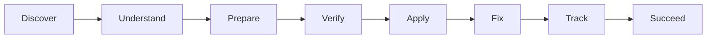
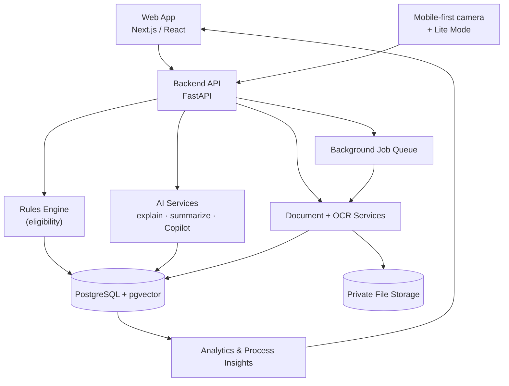
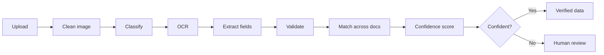

<div align="center">

# 🌄 AAROHAN
### *Rise Beyond. Reach Further.*

**AI-powered scholarship & fellowship platform for Scheduled Tribe students**


> **Don't just process scholarship applications. Prevent application failures before submission.**

[Why](#-1-why-did-we-build-this) · [What](#-2-what-is-aarohan) · [How](#-3-how-does-it-work) · [Tech](#-4-what-is-our-tech-stack) · [Run](#-5-how-do-we-run-it) · [Team](#-6-who-is-on-the-team) · [Future](#-7-whats-next)

</div>

---

## ❓ 1. Why did we build this?

Many eligible ST students miss scholarships or lose months because of **avoidable problems**, not because they are ineligible.

| Problem | What happens |
|---|---|
| Hard to find the right scholarship | Eligible students never apply |
| Eligibility rules are unclear | Wrong applications, or students give up |
| Documents are blurry, missing, wrong or expired | Deficiency notices and delays |
| Names or dates don't match across documents | Extra rounds of checking |
| Officers check the same things by hand | Heavy workload, slow results |
| Status only says *"Processing"* | Students worry and keep asking |
| Language and low-internet barriers | Remote-area students are left out |
| Ministry can't see where the process fails | Same problems repeat every year |
| Little help after selection | Renewals and reports are missed |

These map directly to **SIH26239**: AI and document intelligence, eligibility checks, human oversight, communication, and end-to-end management after selection.

---

## 💡 2. What is AAROHAN?

A helper layer on top of the National Scholarship Portal. It does **not** replace NSP. It guides students, checks documents, and supports officers.



### 🎯 Core idea: Detect → Explain → Fix → Recheck
Most systems find problems **after** submission. AAROHAN finds them **before**: missing, blurry, wrong-type or expired documents, name or date-of-birth mismatch, incomplete form, missing signature or page.

### Who benefits

| Role | How AAROHAN helps |
|---|---|
| **Student** | Finds the right scheme, understands the rules, fixes document issues before submitting, tracks status in their own language |
| **Officer / Verifier** | Sees an AI case summary, extracted data, proof and confidence. Less repeated manual work |
| **Ministry / Admin** | Sees KPIs, bottlenecks and repeated problems. Manages scheme rules. Views the audit trail |

### ✨ Key features

| Area | Features |
|---|---|
| **Discover & Understand** | Scholarship finder with reasons, explainable eligibility, readiness score, guided application, how-to videos and FAQs |
| **Prepare & Verify** | OCR (printed, handwritten, multilingual), document classification, quality check, structured extraction, mismatch detection, **Fix My Application** |
| **Review & Track** | Officer verification queue, AI case summary, human-in-the-loop review, plain-language status timeline, notifications |
| **Access & Improve** | English and Hindi (more later), screen-reader and keyboard support, voice, low-bandwidth mode, mobile document scanning |
| **Ministry & Support** | Analytics funnel, state and district trends, process insights, grievance workflow, post-selection and renewal tracking, audit logs |
| **Saathi (Scholarship Copilot)** | RAG assistant that answers **only** from official documents, with sources |

### 🧩 Explainable eligibility (example)

Eligibility comes from **official rules stored in the database**, never from an AI guess.

| Requirement | Student's value | Result | Proof |
|---|---|---|---|
| ST category | ST | Met | Category certificate |
| Academic qualification | Eligible course | Met | Marksheet |
| Income limit | Within limit | Met | Income certificate |

If a rule isn't met, we say so kindly, show the requirement and the student's value, and suggest other schemes that may fit.

### 📊 Application Readiness (example: 86%)

An open estimate from five visible factors: eligibility completeness, document completeness, document quality, profile consistency, application completeness. It answers: *"If I submit now, how likely am I to face an avoidable deficiency?"* It is **not** government approval.

### 🛠️ Fix My Application (example)

- **Problem:** Income certificate could not be verified with confidence.
- **Why:** The photo is partly blurred.
- **Fix:** Retake in good light, keep the whole page in view, avoid shadows, upload a clear image or PDF.
- **Recheck:** Checks re-run automatically and the readiness score updates.

---

## 📸 Screenshots

- **Landing:** entry screen with one-tap demo and a sample student
- **Student Dashboard:** personalized scholarship matches and profile completeness
- **Scholarship Finder:** search and filter schemes, with eligibility reasons
- **Explainable Eligibility:** every rule checked against the student's profile
- **Saathi Copilot:** assistant that explains schemes and documents, never decides eligibility
- **Application Tracking:** status timeline, deficiency alerts and Fix My Application guidance (Hindi UI)
- **Officer Dashboard:** live verification queue with scrutiny and selection overview
- **Ministry Analytics:** aggregate KPIs and deficiency insights, with no personal data


## ⚙️ 3. How does it work?

### 🏗️ System architecture



**Design choices:** no business logic in the UI, rules live in the database, and slow work (OCR) runs in the background so the screen never freezes.

### 🔑 Golden rule: the AI never decides eligibility

| Component | Role |
|---|---|
| **AI** | Reads, explains, classifies, summarizes |
| **Rules engine** | Decides eligibility from official rules |
| **Human officer** | Makes the final decision |

### 📄 Document intelligence pipeline



| Tool | Job |
|---|---|
| **PaddleOCR** | Main OCR for printed and multilingual text, with text boxes |
| **Tesseract** | Backup OCR when confidence is low |
| **TrOCR** | Handwriting, on cropped text-line areas only |
| **OpenCV / Pillow** | Straighten, remove shadows, improve contrast, resize, compress |

- The **original document is never changed**. A cleaned OCR copy is stored separately.
- Every extracted field stores **value, confidence, page, box location and method**.
- The quality score checks blur, brightness, contrast, crop, glare, shadows, rotation and duplicate pages, and always shows the reason.

### 🧑‍⚖️ Humans stay in charge

| AI confidence | What happens |
|---|---|
| High | Routine verification queue |
| Medium | Officer review |
| Low, or documents conflict | Mandatory human review |

Officers see the original document, OCR text, fields with confidence, box locations, the rule used and all earlier actions. Differences are labelled **"Potential inconsistency – human review required"**. We never call it fraud.

### 🤖 Saathi (Scholarship Copilot) rules
Uses only retrieved official information · never invents rules, deadlines or amounts · never approves or rejects · if unsure, says *"I couldn't verify this from the available official information."*

**Demo AI Mode:** if no AI service is available, fixed sample outputs are used, always labelled as demo data.

### 🔐 Security and privacy

| Area | What we do |
|---|---|
| Access | Role-based access, least privilege, checked on every API call |
| Documents | Private storage, short-lived signed links |
| Uploads | File type and size checks, malware-scan hook |
| Network & abuse | HTTPS only, rate limiting, input validation |
| Secrets | Environment variables only, never in frontend code |
| Accountability | Audit log for important actions |
| Data | Only needed personal data. Demo mode uses fake data |

### 🗄️ Data and API (target design)

- **Database:** `users`, `student_profiles`, `scholarships`, `scholarship_rules`, `applications`, `documents`, `document_extractions`, `document_quality_results`, `document_mismatches`, `eligibility_results`, `deficiencies`, `ai_reviews`, `officer_reviews`, `application_timeline`, `grievances`, `notifications`, `audit_logs`, `fellowship_records`, `knowledge_chunks` and more.
- **Main routes:** `/auth` · `/scholarships` · `/eligibility/check` · `/applications/{id}/readiness` · `/documents/upload` · `/documents/{id}/ocr|verify|quality|mismatch` · `/ai/chat` · `/ai/case-summary` · `/grievances` · `/admin/analytics` · `/admin/audit-logs`

---

## 🧰 4. What is our tech stack?

| Layer | Technology | Purpose |
|---|---|---|
| **Frontend** | Next.js, React, TypeScript | User interface |
| **Styling** | Tailwind CSS | Design system |
| **Backend** | Python, FastAPI | APIs and AI services |
| **Database** | PostgreSQL | Relational data |
| **RAG** | pgvector | Search official documents |
| **Storage** | Supabase Storage / S3-compatible | Private documents |
| **OCR** | PaddleOCR, Tesseract, TrOCR | Printed, backup, handwritten |
| **Image processing** | OpenCV, Pillow | Clean images before OCR |
| **AI / LLM** | Configurable provider (Gemini, OpenAI or similar) | Explanations, summaries, Copilot |
| **Proposed** | Flutter + SQLite, Sarvam AI | Offline-first app, Indian-language voice |

---

 5. How do we run it?

```bash
# 1. Clone
git clone https://github.com/<your-org>/aarohan.git
cd aarohan

# 2. Backend
cd backend
python -m venv venv && source venv/bin/activate     # Windows: venv\Scripts\activate
pip install -r requirements.txt
cp .env.example .env                                 # add your keys
uvicorn app.main:app --reload                        # http://localhost:8000

# 3. Frontend (new terminal)
cd frontend
npm install
cp .env.example .env.local
npm run dev                                          # http://localhost:3000
```

| Variable | Purpose |
|---|---|
| `DATABASE_URL` | PostgreSQL connection |
| `STORAGE_URL` / `STORAGE_KEY` | Private document storage |
| `LLM_API_KEY` | AI provider key |
| `DEMO_AI_MODE=true` | Use labelled sample outputs if no AI key is available |

### 📁 Project structure

```text
aarohan/
├── frontend/                  # Next.js + React + TypeScript + Tailwind
│   ├── app/
│   │   ├── (student)/         # Dashboard, Finder, Applications, Saathi, Profile
│   │   ├── (officer)/         # Dashboard, Queue, Scrutiny, Selection, Grievances
│   │   └── (ministry)/        # Analytics, Audit Trail, Integrations
│   ├── components/            # Reusable UI (cards, timeline, readiness, uploader)
│   ├── lib/                   # API client, i18n (English/Hindi), helpers
│   └── public/                # Icons, images, fonts
├── backend/                   # Python + FastAPI
│   ├── app/
│   │   ├── main.py            # App entry point
│   │   ├── api/               # Routes: auth, scholarships, eligibility, documents, admin
│   │   ├── rules/             # Deterministic eligibility engine
│   │   ├── ocr/               # OCRService: PaddleOCR, Tesseract, TrOCR, OpenCV
│   │   ├── ai/                # Explanations, case summary, Saathi (RAG)
│   │   ├── services/          # Readiness, mismatch detection, notifications
│   │   ├── models/            # Database models
│   │   ├── schemas/           # Request and response schemas
│   │   └── core/              # Config, security, audit logging
│   ├── tests/
│   └── requirements.txt
├── .env.example
└── README.md
```

###  Demo flow (for judges)

1. Log in as **Student** → find a scholarship → see eligibility with proof
2. Upload a blurry income certificate → **Fix My Application** explains and guides
3. Re-upload → readiness score rises
4. Submit → log in as **Officer** → read the AI case summary and evidence
5. Log in as **Ministry** → view analytics and repeated-problem insights

---

## 👥 6. Who is on the team?

| Role | Name | Technical Contribution |
|---|---|---|
| Team Leader | **Divya** | AI/ML, System Architecture, End-to-End Integration and Team Coordination |
| AI/ML Engineer | **Sara Sahni** | OCR, Document Intelligence and AI-based Document Verification |
| AI/ML Engineer | **Rishabh Kumar Singh** | Eligibility Intelligence, Application Readiness and AI-assisted Analysis |
| Backend Engineer | **Ayush Kumar Gupta** | Backend APIs, Database Design and Application Workflow |
| Backend Engineer | **Shubham Raj** | Backend Services, API Integration and System Workflow |
| AI/ML Engineer | **Vyom Soni** | OCR, NLP, Information Extraction and Document Mismatch Detection |

---

## 🔭 7. What's next?

### Future scope
- **DigiLocker / API Setu** verification, QR code and digital-signature checks
- Tamper-suspicion signals and **duplicate-claim detection** across schemes *(these only route cases to a human, they never accuse a student)*
- **NSP sync** and PFMS/DBT payment **simulator**
- **Flutter offline-first app** with Indian-language voice (Sarvam AI)
- More regional and tribal languages
- Smarter Ministry advice from repeated deficiency patterns

### How can we improve it?
- Train OCR and handwriting models on real Indian document samples
- Tune confidence thresholds with officer feedback
- Expand the scheme rule library with state-level scholarships
- Add SMS and IVR for students with limited internet

### Limitations
- Readiness score is an estimate, not government approval
- Some features are planned and not yet implemented
- Demo uses fake data only

---

<div align="center">

**Smart India Hackathon 2026 · SIH26239 · Ministry of Tribal Affairs**

*AAROHAN: because every eligible student deserves to be found.*

</div>
